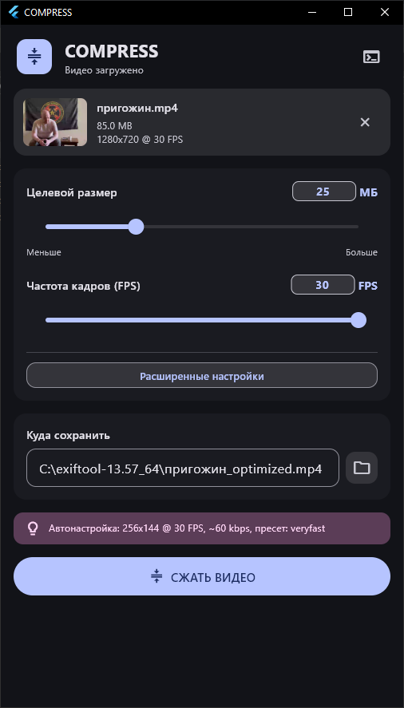

# compress

<sub><sup>очередной шедевр говно-вайбкодинга, собранный при поддержке элитных (и не очень) ИИ-разработчиков Gemini и DeepSeek</sup></sub>

По умному сжимает видео не превращая его в кашу.



## Что он конкретно делает:

1. **Считает битрейт:** Автоматически подбирает видеобитрейт под целевой размер файла, длительность и выбранное разрешение.
2. **Жмёт видео:** Через FFmpeg пережимает выбранным кодеком (H.264, H.265, AV1) с нормальными пресетами.
3. **Режет FPS и разрешение:** Можно понизить частоту кадров и разрешение под нужды.
4. **Работает со звуком:** Оставляет оригинал, пережимает в Opus/AAC или удаляет.
5. **FastStart для web:** Генерирует файлы, готовые к потоковому воспроизведению в браузере.

---

## Фичи:

* **FFmpeg сам подтягивается:** Если нет FFmpeg — скачает сам из официального GitHub, покажет прогресс и скорость загрузки.
* **Цветные логи:** Кнопка «Журнал событий» открывает диалог с цветными сообщениями, поиском и копированием.
* **Drag-and-Drop:** Взял-и-Бросил.
* **Material Design 3:** Адаптивный интерфейс с динамической темой и акцентным цветом Windows. Я дрочу на md3.
* **Ограничение по оригиналу:** Никакие ползунки не дадут выставить параметры выше исходного видео.
* **Русский интерфейс:** Пошли нахуй бургеры ебаные.

---

## Установка и запуск

### Вариант 1
1. Перейдите в раздел **[Releases](https://github.com/lepex1/compress/releases)**.
2. Скачайте архив `compress-win-x64.zip`.
3. Распакуйте в любое место и запустите `compress.exe`.

### Вариант 2
```bash
# Клонируем репозиторий
git clone https://github.com/lepex1/compress.git

# Переходим в папку проекта
cd compress

# Собираем и запускаем
flutter build windows --debug
./build/windows/x64/runner/Debug/compress.exe
```

### Вариант 3 (для разработки)
```bash
git clone https://github.com/lepex1/compress.git
cd compress
flutter pub get
flutter run -d windows
```
